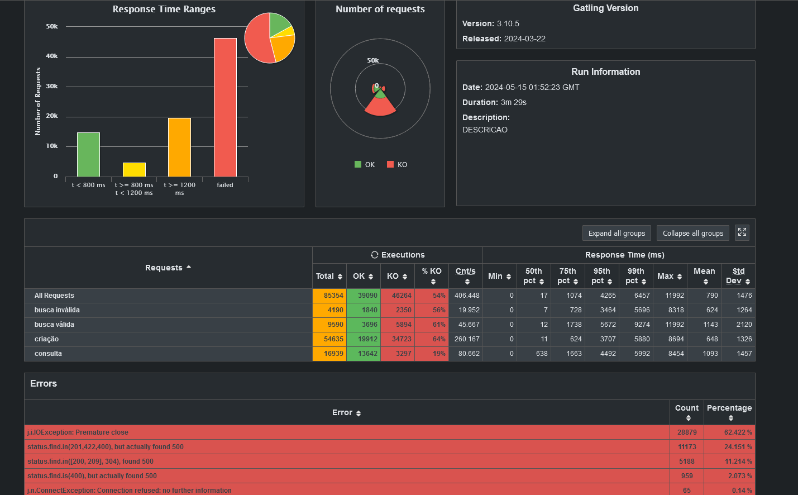
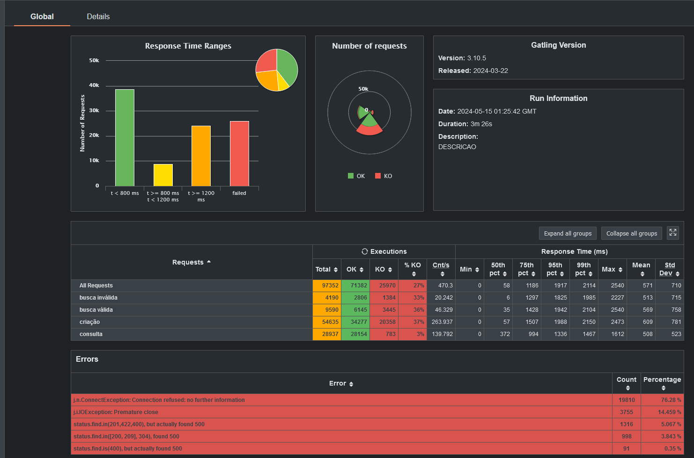

Testes feitos em uma maquina 
CPU FX-8300
RAM 16gb DD3 1333mhz
armazenamento SSD

---
## Sexta versão

Ao tentar usar duas instancias do sistema, foi preciso fazer a busca por termo pelo banco de dados, isso derrubou a performance praticamente pela metade

Então para tentar melhorar, adicionei uma regra no nginx.conf, onde as consultas por termo ficam na instancia2 e o restante fica na instancia1
Isso melhorou o desempenho, saindo de 16k para 19k.

O melhor ainda é com uma só instancia e fazendo a consulta por termo no usando cache local.

#### Quantidade de registros criados -> +-19953

---## Quinta versão

Usando **Finalmente** nginx
Porem com uma instãncia da aplicação

#### Quantidade de registros criados -> +-28937 (Sim uma perda de criações :']. Motivo: NãoTenhoIdéia.exe)

---
## Quarta versão

- Agora toda pesquisa é feita apenas no cache, NADA DE SEARCH EM BANCO NESTE LUGAR! 
- Descobri um "bug". Aparentemente o gattling estava requisitando portas que não estavam disponíveis no windows.
  - Para solucionar, foi necessário o range de portas que podem ser criadas no Windows
    - https://learn.microsoft.com/en-US/troubleshoot/windows-server/networking/default-dynamic-port-range-tcpip-chang

#### Quantidade de registros criados -> 32.374 ~ 33.899

---
---
## Terceira versão

Criação de coluna para armazenar dados das colunas apelido, nome e stack para facilitar a consulta por termo, não melhorou a performance. =(

- Criação de cache local para fazer brincadeiras sem acessar base de dados com frequência. 
  - Agora ao criar um dado na API de criação, o mesmo será armazenado em cache.
  - API de busca por ID usará os dados do cache q a API de criação gerou, sem acessar o banco.
  - API de busca por termo usará os dados do cache q a API de criação gerou, sem acessar o banco.

#### Quantidade de registros criados -> 18.629 ~ 18.917

---
## Segunda versão

Ajustes de validação e response da location na criação
- Retornando Id da pessoa no HEADER da API de criação. 
- Ajustes na validação dos itens da lista de stack. 
  - Cada item pode ter no máximo 32 caracteres 
  - Não pode ter item nulo
  - Ajuste de tamanho da tabela no banco de dados

#### Quantidade de registros criados -> 17.555

---

## Primeira versão
